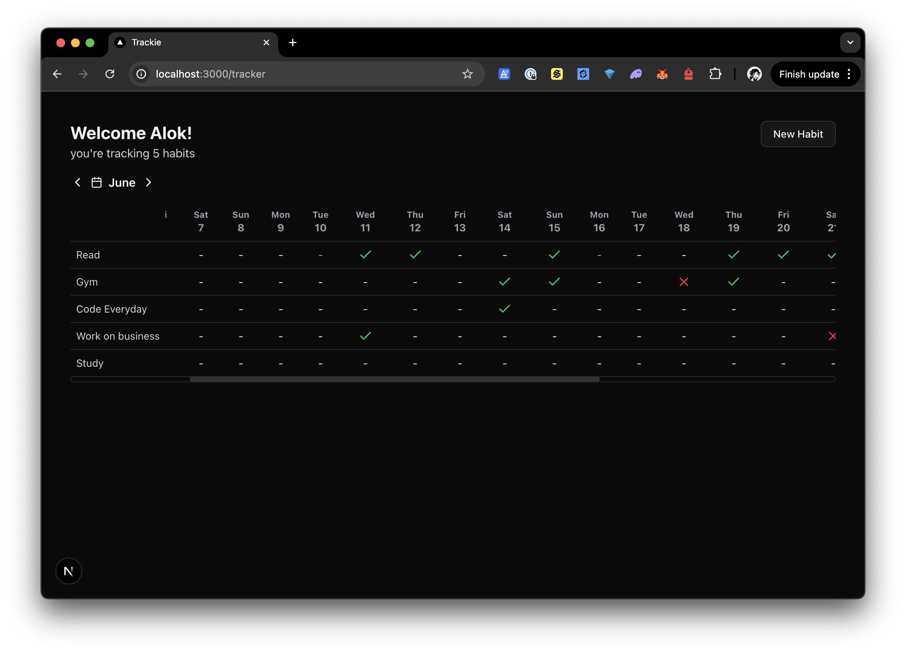
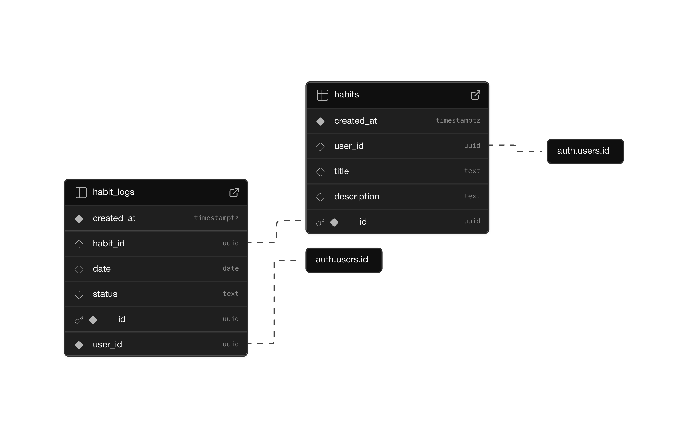

<p align="start">
  
  
  
</p>

# Trackie

A simple habit tracker for web. It is highly inspired by [Loop Habit Tracker](https://play.google.com/store/search?q=loop%20habit%20tracker&c=apps) and only built because I wanted a similar thing on web / iOS.

---

## How to run?

1. **Clone the repository**  
   ```sh
   git clone https://github.com/alok8bb/trackie.git
   cd trackie
   ```

2. **Set up environment variables**  
   Copy the sample file and add your [Supabase](https://supabase.com/) project credentials:
   ```sh
   cp env.sample .env.local
   ```
   Then fill in the required `SUPABASE_URL`, `SUPABASE_ANON_KEY`, etc.

3. **Set up the database schema**  
   If you're setting up your own Supabase instance, you'll need to create the required tables. You can use the SQL in [`supabase/schema.sql`](supabase/schema.sql).

4. **Install dependencies**  
   ```sh
   npm install
   # or
   pnpm install
   ```

5. **Start the development server**  
   ```sh
   npm run dev
   # or
   pnpm dev
   ```

6. Open [http://localhost:3000](http://localhost:3000) in your browser.

---

## Contributing

This is a beginner friendly project, feel free to explore and contribute! If you have an idea for a new feature or improvement, just build it and open a pull request. 

---

## Todo

- <del>Logout button on top right corner with profile logo maybe</del>
- Colored habits: ask for a few pre-defined colors while adding a habit in the new habit dialog.
- PWA and responsive design for usability on phones.
- Listing streaks & delete button on hovering the habits in main tracker, maybe a dedicated page with git graph-like view for the completed habits.
- Optimizations on how Supabase stuff is handled since I dunno Supabase.

---

## Screenshots


